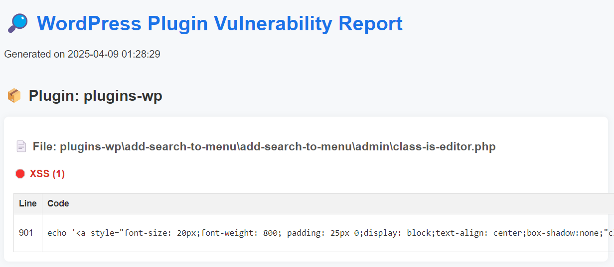

# PHP Vulnerability Scanner
<br>

### Environment
```bash
pip install -r requirements.txt
```

### To target wordpress plugins

#### download wordpress plugins
```bash
python3 wp-downloader.py
# Enter keywords separated by spaces (e.g., seo security backup)
# Enter start page number and end page number
```

#### scanning wordpress plugins
```bash
python3 scanner.py

# Example
PS C:\Users\bizje\Desktop\yen\PHP-scanner> python3 scanner.py

██████╗ ██╗  ██╗██████╗     ███████╗ ██████╗ █████╗ ███╗   ██╗███╗   ██╗███████╗██████╗
██╔══██╗██║  ██║██╔══██╗    ██╔════╝██╔════╝██╔══██╗████╗  ██║████╗  ██║██╔════╝██╔══██╗
██████╔╝███████║██████╔╝    ███████╗██║     ███████║██╔██╗ ██║██╔██╗ ██║█████╗  ██████╔╝
██╔═══╝ ██╔══██║██╔═══╝     ╚════██║██║     ██╔══██║██║╚██╗██║██║╚██╗██║██╔══╝  ██╔══██╗
██║     ██║  ██║██║         ███████║╚██████╗██║  ██║██║ ╚████║██║ ╚████║███████╗██║  ██║
╚═╝     ╚═╝  ╚═╝╚═╝         ╚══════╝ ╚═════╝╚═╝  ╚═╝╚═╝  ╚═══╝╚═╝  ╚═══╝╚══════╝╚═╝  ╚═╝

[+] Progress: 100% (10245/10245)
[+] Scan Complete.
[+] Vulnerable files detected: 66
[+] Results saved to scan_result.json

[+] Vulnerability Summary:
    [+] SQLi: 0
    [+] XSS: 103
    [+] LFI: 0
    [+] RCE: 0
    [+] SSRF: 9
    [+] CSRF: 3
```

#### generate report
```bash
python3 generate_report.py
```




